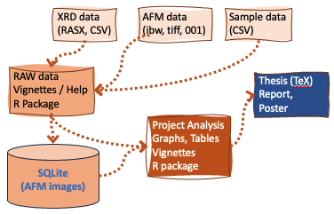

<!-- README.md is generated from README.Rmd. Please edit that file -->

# RAWdataR

<!-- badges: start -->

[](https://app.codecov.io/gh/thomasgredig/RAWdataR?branch=master)
<!-- badges: end -->

`RAWdataR` provides a framework in R language to uniquely track and
analyse raw data from scientific instruments. It assigns unique file IDs
based on MD5 sums. This means that even after renaming the files or
moving them to different folders, the analysis package can refer to its
ID to retrieve the data. Aligned with the National Science Foundation,
the [Open Data at NSF](https://www.nsf.gov/data/) describes the
underlying goals; it also fosters maintaining metadata.

The `RAWdataR` R package supports the following workflow:

- Creation of unique IDs for all files in a data project
- Basic validation and organization of the scientific data

## Installation

You can install the released version of RAWdataR by:

``` r
# install.packages("devtools")
devtools::install_github("thomasgredig/RAWdataR")
```

## Documentation

The **[reference
documentation](https://thomasgredig.github.io/RAWdataR/)** has examples
and a list of all functions published in this package.

## RAW Data Management Protocol

`Raw data` is considered the direct output of a scientific instrument
(XRD, AFM, etc.). We will follow a few principles for the
`data R package`:

1)  The data is stored in a **non-proprietory format**, such as comma
    separated values (.csv) and R Data (.rda) or SQLite database
    (.sqlite); therefore, the data can be accessed beyond the
    instrument’s lifetime. If an instrument uses a proprietary data
    format, then it needs to be converted into an open-source data
    format.

2)  All `Raw data` files in the project are given a unique `RAW ID`. The
    ID refers to a particular file and is associated with additional
    parameters, such as a sample name, temperature, etc. - the ID is
    limited to the data package and different packages may have the same
    ID.

3)  Multiple collaborators can add data without corruption; i.e. data
    can be appended without the need for full access to the `Raw data`.

4)  Some `Raw data` may not become part of the data package to limit the
    size. Large data files are stored in SQL format (`sqlite`) outside
    the package.

5)  The data package should include a sufficient description of samples
    and procedures to understand the instrument RAW data.

### Data and Project

The analysis and graphing of the data is in a separate project package.
The data package is distinct and provides access to the data in a
convenient format. If possible, it does not apply modeling or analysis
to the data, but rather makes all data available in a central package.

<figure>

<figcaption aria-hidden="true">Data package and Project package play
distinct roles.</figcaption>
</figure>

### Naming Convention

In order to achieve scientifically reproducible data, we shall follow
these follow principles:

- `Raw data` cannot be altered and are assigned a unique ID for reliable
  data analysis.
- `Raw data` file names can be changed or corrected or stored in a
  different subfolder without affecting the unique IE, which is
  automatically reconciled using the MD5 CRC string.
- All data files must be in non-proprietary formats, if not, then a
  second file with the converted text or ASCII format content needs to
  be saved as well. If possible, data file names should include the
  following formatting information:

> Date_Project_Initials_Tool_Sample_RunInfo.csv

- sub folders in the RAW folder are useful and can contain additional
  information; but note that the path file name is mutable and the
  unique ID must be used.

The **date** is in `yyyymmdd` format and represents the date of the data
collection start. The **project string** is assigned by the project
manager and the initials are from the person collecting data.

**Tools** are short strings and represent the machine taking the data,
see [Tool List](https://github.com/thomasgredig/MSthesis-Guidelines).

Each **sample** should have a unique name, generally starting with the
initials of the person, and following the date of sample creation. If
more than 1 data collection is made in one day, then **RunInfo** is
added to distinguish or to add more description to the RAW data file.

## Example

This is a basic example which shows you how to check your RAW folder

``` r
library(RAWdataR)
raw.updateID(path.RAW)
```

### Loading RAW Data

For graphing and data analysis the correct files need to be loaded. A
common approach would be searching data files by `project`, `date`,
`user`, or by `instrument`.

``` r
# for instance, find all VSM files from 2018
file.list = raw.findFiles(path.RAW, date='2018', instrument='vsm')
```

As more data is stored, the `file.list` may change overtime. Therefore,
the approach to ensure reproducibility requires the generation of a MD5
string using `raw.getPartialMD5str`, once the exact file list is
established, it can be hard-coded as a string (see below for 4 files).
Even if more files are generated, the file list is restricted by the MD5
codes.

``` r
md5String = raw.getPartialMD5str(file.list)
file.list = raw.findFiles(path.RAW, date='2018', instrument='vsm',
    md5 = 'a25f3a,66c5d1,4a0333,1b94b5')
```

### Invalid Files

You can also find files with invalid naming convention using the
following function, where date is optional

``` r
raw.getInvalidFiles(path.RAW, date='2020')
```

### File Checking

Instead of using direct filenames, you can use checksums from the files.
For a project that has data added all the time, you could have the
following code:

``` r
library(RAWdataR)
s = raw.getPartialMD5("README.md")

file.list = dir()
# this will return 'README.md'
filename = raw.getFilename(file.list,s)
```

## Data Project

If you have a new project with RAW data, you can quickly initialize it
using the `raw.dataProject()` function. It will prompt you to select a
directory that has a `RAW` subfolder and then generate the R data
package. Once generated, you can open the new data package and run the
`_init.R` code, which helps you prepare a documented data package.
Afterwards, it is recommended to add tests to verify data content.

``` r
RAWdataR::raw.dataProject()
```

You can use `raw.dataMaker()` to generate a make.data..R file that
creates a dataset.

## Data Standards

We distinguish between digital data from experimental instruments (AFM,
XRD, spectrometer, etc.) and analog data (observations, sample names,
etc.). All raw instrument data is stored in standardized,
open-accessible formats and/or CSV tables, if possible.

A quality control procedure should be in place.

Data analysis will be organized, reproducible and open access. Raw and
m’’;’lkjhgfd eta data is saved in R packages. The primary analysis of
scientific data is either in R packages or jupyter notebooks. Naming
conventions are to be followed.
